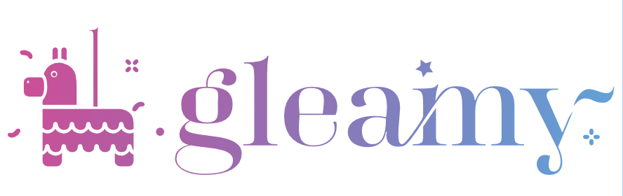

[](https://www.npmjs.com/package/gleamy) [](https://www.npmjs.com/package/gleamy) [](https://www.npmjs.com/package/gleamy) [](https://snyk.io/advisor/npm-package/gleamy) [](https://snyk.io/advisor/npm-package/gleamy)


# 🪩 Gleamy
Gleamy is free for non-profit organizations:
See: https://opensource.org/licenses/NPOSL-3.0



Give it a shot! 
```
    import { GleamyProvider, Glitter } from 'gleamy';
    
    <GleamyProvider>
        <Glitter intensity={0.5} depth={50} depthAlpha={true} height={200} width={200} glitterCoverage={5} glitterSize={1} glitterColor={"gold"} />
    </GleamyProvider>
```